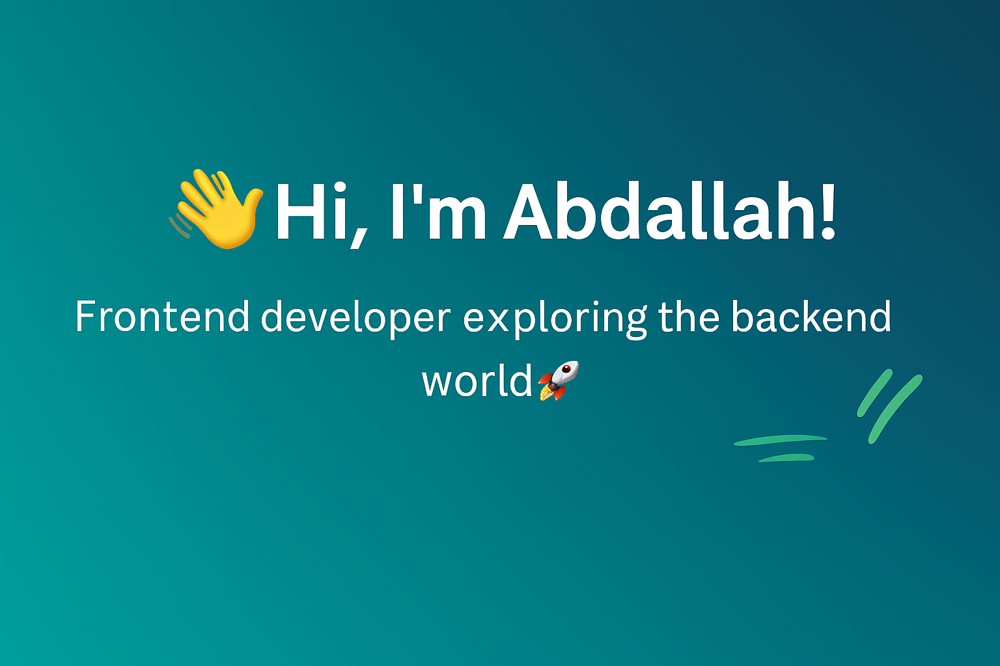

 
 
 
 
 

<h2>Hey there 👋 I'm Abdallah</h2>

I'm a frontend developer who enjoys building clean and simple web apps 🚀.  
Currently diving into the backend world 🌱 while keeping things fun and easy-going 😅.  

<h2>⚡ Skills</h2>

**Frontend:**  
- HTML, CSS, Bootstrap, JavaScript, React  
- Git & GitHub  

**Currently Learning (Backend):**  
- Node.js  
- Databases (SQL/NoSQL)  

<h2>📊 GitHub Stats</h2>

